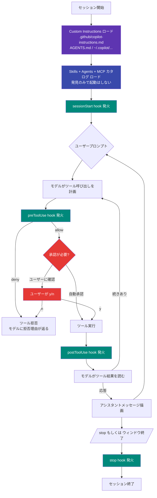
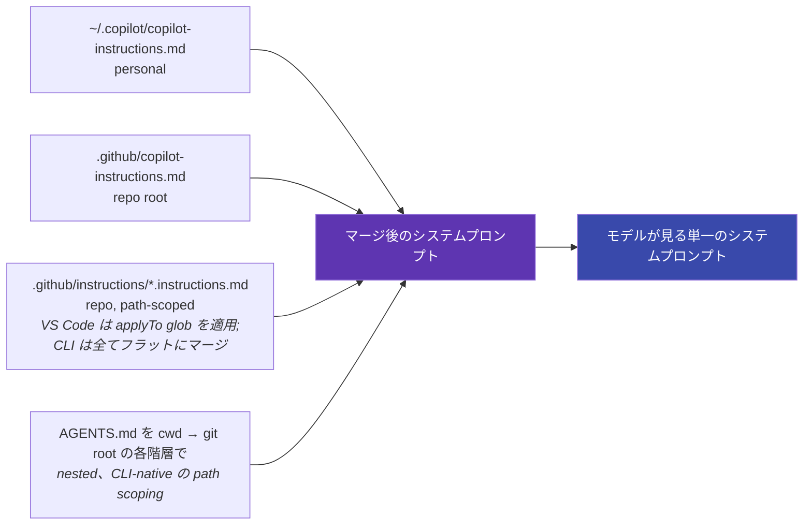

# メンタルモデル — 全レイヤーが一緒に動く仕組み

各カスタマイゼーションのページが **各レイヤー単体** の説明なのに対し、このページは
1 回の Copilot ターンの中で **何が、いつ起きるか** を説明します。「hook が動かない」
「instruction が効いていない」「Skill が拾われていない」というときに読み返すページ
です。原因は大抵「想定と違うフェーズで動いていた」だけだからです。

!!! abstract "対応ホスト"
    🟢 **Copilot CLI** · 🟢 **VS Code** — 以下のライフサイクルは両ホストで同一です。
    UI（CLI のインラインプロンプト vs VS Code Chat パネル）は異なり、イベント名も
    一部表記揺れがあります（CLI の `sessionStart` ≈ VS Code の `SessionStart`）が、
    instructions / hooks / skills / MCP / agents の **評価順** は同じです。

## エージェントループ — 1 ターンを最初から最後まで

3 色、3 つの役割:

- **紫 = セッション単位で 1 回ロードされる「ハーネス」**: Instructions、Skills、
  Agents、MCP カタログ。セッション開始後に変更するには大抵 `/refresh`（CLI）か
  Chat パネル再読み込み（VS Code）が必要
- **緑 = hooks**: ループの各イベントに hook サーフェスがある。「shell コマンド
  実行直前」「書き込み直後」「ユーザーが終了したとき」など、瞬間を言葉にできるなら
  対応する hook がある
- **赤 = humans in the loop**: 承認プロンプトはすべてのリスクのあるツール呼び出しを
  gate する。自動承認はプロンプトを消すが **hook は消えない** — preToolUse hook は
  自動承認後でも発火し、拒否できる

## この絵の中で各レイヤーが何をしているか

| レイヤー | *ロード* 時点 | *実行* 時点 | 何に影響するか |
|---|---|---|---|
| **Custom Instructions** | セッション開始時 (B) | 暗黙 — 全プロンプトにマージ済み | トーン、慣習、散文のハードルール |
| **Prompt Files** | オンデマンド（ユーザーが `/foo` と入力した時） | ステップ E（ユーザープロンプト） | ユーザーが入力する内容を置き換える |
| **Skills** | C で発見 | モデルが使うと判断した時にコンテキストにロード | エージェントが従うステップ + 補助スクリプト |
| **Hooks** | C で発見 | D / G / L / P で発火 | モデルの意図とは無関係な **機械的** ゲート |
| **MCP** | カタログは C、サーバーはオンデマンド起動 | ステップ F でモデルが MCP ツールを選択 | モデルのツールボックスに typed ツールを追加 |
| **Custom Agents** | C で発見 | ステップ F でモデルが委譲を選択 | 独自のループ + ツールを持つサブエージェント |

最大の混乱ポイントは **Instructions と Hooks の違い** です:

- Instructions は「モデルが従う *べき*」アドバイス。モデルは無視できる。
  振る舞いに **統計的に** 影響する
- Hooks はランタイムが「**必ず実行する**」コード。モデルは無視できない。
  振る舞いに **機械的に** 影響する

「毎回必ず守られないと困るルール」 — 例: 「`git push --force` は絶対やらない」
— なら **hook** に書くべきで、instruction ではない。逆に「好みの問題」 —
例: 「npm より pnpm を優先」 — なら **instruction** で十分で、hook にする必要はない。

## 承認はどこに座っているか

承認は **hook とは別物** です。具体的には:

- ランタイムがポリシー (`--allow-tool` / `--deny-tool`、VS Code の
  `chat.tools.autoApprove`、リポジトリ permission 設定) に基づいて、そのツールに
  承認が必要かを判断
- 必要ならユーザーに確認 (J)
- **独立して**、preToolUse hook がツール実行前 (G) に発火
- preToolUse hook は **自動承認済みの呼び出しでも拒否できる** — hook は常に
  自動承認に勝つ

これが [ガバナンスセクション](../governance/approval-cheatsheet.md) で「**寛容な
自動承認リスト + 厳格な deny-list hook** をペアで運用しろ」と推奨される理由です。
hook はメカニカルな最終防衛線、承認リストは単に UI ノイズを減らすためのもの。

## Instructions のマージ順

セッション開始時 (ステップ B) にランタイムが複数の場所を walk して連結します。
おおまかな優先順位:

2 つ覚えておくこと:

1. **モデルが見るのはマージ後の結果だけ**。どのファイル発のルールかは知らない。
   矛盾する instruction は黙って連結され、モデルは「重み」で勝った方を取る
2. **`applyTo` は VS Code 専用フィルタ**。Copilot CLI は
   `.github/instructions/*.instructions.md` を読むが、`applyTo` glob を無視して
   **全部マージ** する。CLI で path scoping したいなら、対応するディレクトリに
   **nested `AGENTS.md`** を置く

## 「X が効いてない」をデバッグする場所

| 症状 | 最有力候補 | 確認方法 |
|---|---|---|
| 「instruction が効いてない」 | ファイル作成/編集前にセッションが起動済み | `/refresh`（CLI）or Chat 再読み込み |
| 「hook が発火しない」 | イベント名間違い（camelCase vs PascalCase）or hook が silent error | `--debug`（CLI）or Output → GitHub Copilot Chat（VS Code） |
| 「Skill が拾われない」 | 発見対象パスにない、`SKILL.md` の frontmatter 不正 | `copilot --debug` が起動時に発見した skill を列挙 |
| 「MCP ツールが見えない」 | サーバー起動失敗、or `--allow-tool` ポリシーで除外 | `/mcp`（CLI）でサーバー毎の状態確認 |
| 「自動承認で危険コマンドが通った」 | preToolUse hook 未設定、or regex がマッチしない | hook を合成イベントペイロードでテスト |

## 3 色のコンポジション

実際のワークフローは **紫 + 緑 + 赤** を組み合わせます。ここで「PR を開く」1 ターンを
上のループに紐付けて見ます:

1. **紫** — B/C でエージェントが `.github/copilot-instructions.md` (「main に
   `git push --force` 禁止」) をロードし、`pr-summary` Skill を発見、`github` MCP
   サーバーを登録
2. **ユーザープロンプト** E: *「サマリ付きで PR を開いて」*
3. **モデル** F で `pr-summary` Skill を呼ぶことを決定
4. **Hook** G (`preToolUse` で `bash -c "git push *"` にマッチ) が push **前** に
   発火、ブランチが `main` でないことを確認
5. **承認** I/J: push はワンショットで自動承認されない、ユーザーに確認
6. **ツール実行** K、続いて **postToolUse hook** L が `~/.copilot/audit.log` に
   1 行追記
7. **Stop hook** P がセッション終了前にワーキングツリーに `gitleaks` を流す

各レイヤーが自分の役割を 1 回ずつ果たす。誰も他人の仕事を奪わない — それが 6 つ
ある意味です。

## 次に読む

→ [ガバナンス概要](../governance/index.md) — 同じループを「何がうまくいかないか」
の視点で

→ [レシピ集](../recipes/index.md) — ループをエンドツーエンドで使う実例
