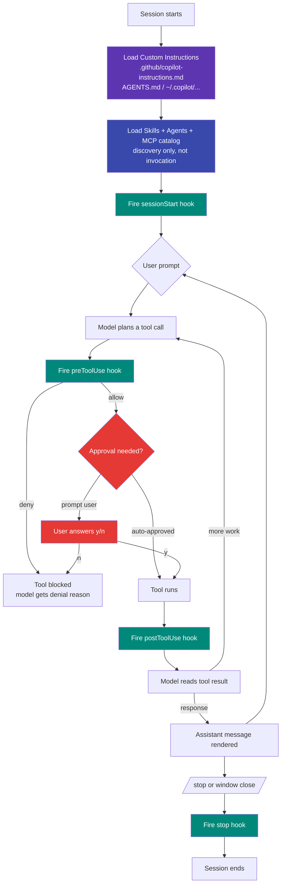
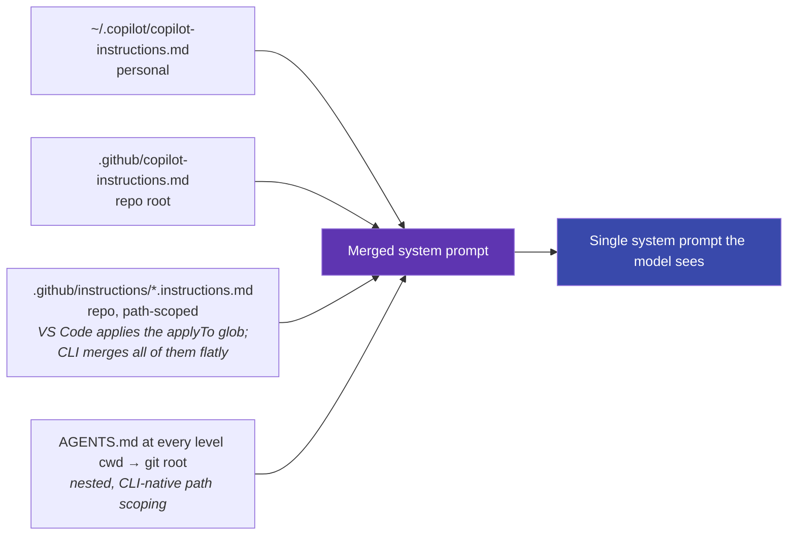

# Mental model — how all the layers run together

If the six customization pages explain **each** layer in isolation, this page
explains **what fires when** during a single Copilot turn. It's the page to
re-read whenever a hook didn't run, an instruction didn't apply, or a Skill
wasn't picked up — because the answer is almost always "it ran in a
different phase than I thought."

!!! abstract "Where it works"
    🟢 **Copilot CLI** · 🟢 **VS Code** — the lifecycle below is identical
    between hosts. The UI is different (CLI inline prompts vs. VS Code Chat
    panel), and a few events have slightly different names (e.g. CLI
    `sessionStart` ≈ VS Code `SessionStart`), but **the order** in which
    instructions / hooks / skills / MCP / agents are evaluated is the same.

## The agentic loop — one turn, end to end

Three colors, three roles:

- **Purple = harness loaded once per session.** Instructions, Skills, Agents,
  MCP catalog. Changing these after a session has started usually requires
  `/refresh` (CLI) or reloading the Chat panel (VS Code).
- **Teal = hooks.** Every event in the loop has a hook surface. If you can
  describe the moment you want to react ("right before any shell command",
  "right after a write", "when the user exits"), there's a hook for it.
- **Red = humans in the loop.** Approval prompts gate every risky tool call;
  auto-approve removes the prompt but **does not** remove the hook —
  preToolUse hooks still fire and can still deny.

## What each layer does in this picture

| Layer | When it's *loaded* | When it *runs* | What it influences |
|---|---|---|---|
| **Custom Instructions** | At session start (B) | Implicit — merged into every prompt | Tone, conventions, hard rules in prose |
| **Prompt Files** | On demand (when user types `/foo`) | At step E (user prompt) | Replaces what the user would have typed |
| **Skills** | Discovered at C | Loaded into context when the model decides to use one | Steps + helper scripts the agent follows |
| **Hooks** | Discovered at C | Fire at D / G / L / P | **Mechanical** gates, regardless of model intent |
| **MCP** | Catalog discovered at C, servers spawned on demand | At step F when the model picks an MCP tool | Adds typed tools to the model's toolbox |
| **Custom Agents** | Discovered at C | At step F if model chooses to delegate | Sub-agents with their own loop + tools |

The single most common confusion is **Instructions vs. Hooks**:

- Instructions are advice the model *should* follow. The model can ignore
  them. They influence behavior **statistically**.
- Hooks are code the runtime *will* run. The model can't ignore them. They
  influence behavior **mechanically**.

If a rule must hold *every time* — for example "never run `git push --force`"
— it belongs in a hook, not in an instruction. If a rule is about *taste* —
for example "prefer pnpm to npm" — it belongs in an instruction, not a hook.

## Where approval sits

Approval is **separate from hooks**. Concretely:

- The runtime decides whether a tool needs approval based on policy
  (`--allow-tool` / `--deny-tool`, VS Code `chat.tools.autoApprove`, repo
  permission config).
- If it does need approval, the user is prompted (J).
- **Independently**, preToolUse hooks fire (G) before the tool is run.
  A preToolUse hook can deny a call that was already auto-approved —
  hooks always win over auto-approve.

This is why the [governance section](../governance/approval-cheatsheet.md)
recommends pairing **a permissive auto-approve list** with **a strict
deny-list hook**. The hook is your final mechanical line of defense; the
approval list is just about reducing UI noise.

## How instructions get merged

At session start (step B), the runtime walks several places and concatenates
what it finds. In rough priority order:

Two things to internalize:

1. **The model only ever sees the merged result.** It does not know which
   file a rule came from. Conflicting instructions are silently
   concatenated; the model picks whichever it weighs more.
2. **`applyTo` is a VS Code-only filter.** Copilot CLI reads
   `.github/instructions/*.instructions.md` files but merges **all of them**
   into the system prompt regardless of the `applyTo` glob. The CLI-native
   way to scope instructions by path is **nested `AGENTS.md`** at the
   directory you want them to apply to.

## Where to debug when "X didn't apply"

| Symptom | Most likely cause | Check |
|---|---|---|
| "My instruction didn't apply." | Session was started before the file existed / was edited. | `/refresh` (CLI) or reload Chat. |
| "My hook didn't fire." | Wrong event name (camelCase vs PascalCase), or the hook errored silently. | Run with `--debug` (CLI) or check Output → GitHub Copilot Chat (VS Code). |
| "My Skill wasn't picked up." | Skill not in a discovery location, or `SKILL.md` lacks valid frontmatter. | `copilot --debug` lists discovered skills at startup. |
| "My MCP tool isn't visible." | Server failed to spawn, or filtered out by `--allow-tool` policy. | `/mcp` (CLI) shows status per server. |
| "Auto-approve let through a bad command." | preToolUse hook missing or regex doesn't match. | Test hook with a synthetic event payload. |

## Composition, in three colors

A real workflow uses **purple + teal + red** together. Here's a single
"merge a PR" turn annotated against the loop above:

1. **Purple** — at B/C the agent loads your `.github/copilot-instructions.md`
   ("never `git push --force` to main"), discovers a `pr-summary` Skill,
   and registers the `github` MCP server.
2. **User prompt** at E: *"Open a PR with a generated summary."*
3. **Model** at F decides to call the `pr-summary` Skill.
4. **Hook** at G (`preToolUse` matching `bash -c "git push *"`) fires
   *before* the push and checks the branch isn't `main`.
5. **Approval** at I/J: the push is one-shot, not auto-approved, so the
   user is prompted.
6. **Tool runs** at K, then **postToolUse hook** at L writes a single
   line to `~/.copilot/audit.log`.
7. **Stop hook** at P runs `gitleaks` on the working tree before the
   session ends.

Every layer played its role exactly once. None of them tried to do
another layer's job — and that's the point of having six.

## Next

→ [Governance overview](../governance/index.md) — the same loop, viewed
through the lens of "what can go wrong."

→ [Recipes](../recipes/index.md) — worked compositions that exercise the
loop end to end.
