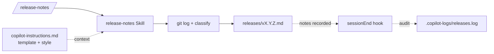

# ✨ キャップストーン — リリースノートパイプライン

🟡 **中級 · 約45分**

## 学習目標

この演習を終えると、次のことができるようになります:

- 4 つのカスタマイズ（インストラクション + プロンプトファイル + スキル + フック）を **組み合わせて**、1 本のパイプラインにできるようになります。
- 1 つのスラッシュコマンドを実行して、`git log` から構造化された `releases/vX.Y.Z.md` を生成できるようになります。
- メインのワークフローではなく、**監査 / 可観測性** のためにフックを使えるようになります。

## 前提条件

- **演習 1（カスタムインストラクション）**、**演習 2（プロンプトファイル）**、**演習 3（スキル）**、**演習 6（フック）** を終えていること。（同じスクラッチ用リポジトリを使い回して構いません。）
- `main` に少なくとも 5〜10 コミットあるリポジトリ。リリースノートで要約する材料が必要です。
- 約45分。

## チェックポイントコミット

```bash
git commit --allow-empty -m "checkpoint: before capstone"
```

## シナリオ

チームでは隔週金曜日にリリースを切ります。いまは誰かが `git log` を手で読み、コミットを手作業でグルーピングし、リリースノートを書いています。これを 1 コマンド、つまり `/release-notes v1.2.0` だけで `releases/` に完成したファイルが落ちる形にしたい状況です。

## アーキテクチャ



4 つのレイヤーで、1 つの結果を出します:

| レイヤー | 役割 |
|---|---|
| **カスタムインストラクション** | リリースノートのテンプレートとスタイル（"imperative mood, no trailing period"）を定義します。 |
| **プロンプトファイル** | `/release-notes <tag>` の入り口です。バージョンを `$ARGUMENT` として受け取ります。 |
| **スキル** | 実際のワークフローです。`git log` を読み、Conventional Commits で分類し、テンプレートを埋めます。 |
| **フック** | `sessionEnd` がリリース生成を記録します（監査用）。ただし **ファイルは作成しません**。それはスキルの役割です。 |

## 手順

### 1. カスタムインストラクション — テンプレート

`.github/copilot-instructions.md` に追記します:

```text
## Release notes

When asked to produce release notes, follow this template exactly:

  # vX.Y.Z — [date]

  ## Highlights
  [one or two sentences, user-facing]

  ## Features
  [bulleted `feat:` commits]

  ## Fixes
  [bulleted `fix:` commits]

  ## Other
  [docs / chore / refactor / perf]

Each bullet is the commit subject, in past tense, with the short SHA in
parentheses at the end.
```

### 2. プロンプトファイル — エントリポイント

`.github/prompts/release-notes.prompt.md`:

```text
---
description: "Generate release notes for a version tag."
argument-hint: "[version, e.g. v1.2.0]"
---

# /release-notes

The user gave you `$ARGUMENT` as the version (e.g. `v1.2.0`). If empty, ask.

Delegate the actual work to the `release-notes` Skill. The skill is responsible
for git inspection, classification, and writing the file. Pass `$ARGUMENT`
through.

When the skill finishes, print the path to the generated file and ask the user
whether to commit it.
```

### 3. スキル — ワークフロー

```bash
mkdir -p .github/skills/release-notes
```

`.github/skills/release-notes/SKILL.md`:

```text
---
name: release-notes
description: |
  Generate release notes for a version tag from git history. Trigger via
  /release-notes, or natural language: "draft release notes for v1.2.0".
license: MIT
---

# release-notes

Produce `releases/[version].md` for the given version, grounded in `git log`.

## Output Contract

When this skill finishes:

1. `releases/[version].md` exists.
2. It has the four sections from `copilot-instructions.md` (Highlights /
   Features / Fixes / Other).
3. Every bullet ends with `(SHORT_SHA)`.

## Workflow

1. Find the **previous** version tag: `git tag --sort=-v:refname | grep -E
   '^v[0-9]' | head -2 | tail -1`. If none, use the repo root commit.
2. Run `git log --pretty='%h %s' [prev]..HEAD`.
3. Classify each commit by its Conventional Commits type prefix:
   - `feat:` → Features
   - `fix:` → Fixes
   - else → Other
   - no prefix → Other, with a `(?)` warning
4. Write the file at `releases/[version].md` using the template from
   `copilot-instructions.md`.
5. Print the path.
6. Optionally: suggest the commit message.

## Rules

- Never invent commits. Only summarize what's in `git log`.
- If two commits have the same subject (squash artifact), dedupe.
- If a `feat:` commit has a body referencing a breaking change, surface that as
  the first bullet in Highlights.
```

### 4. フック — 監査ログ { #4-hook-the-audit-trail }

[演習 6](06-hooks.md) の `sessionEnd` フックを拡張します:

`.github/hooks/session-logger/log-session-end.sh` の最終行の前に、次のブロックを追加します:

```bash
# Audit: did this session produce a release notes file?
if ls releases/*.md >/dev/null 2>&1; then
  LATEST="$(ls -t releases/*.md | head -1)"
  echo "[$TS] AUDIT session=$SESSION_ID generated_release=$LATEST" \
    >> "$LOG_DIR/sessions.log"
fi
```

このフックは **受動的** です。観測してログに残すだけで、リリースノート自体は生成しません。それはスキルの仕事です。

### 5. パイプラインを実行する

適切な接頭辞を持つコミットがいくつかあることを確認します:

```bash
echo a > a.txt && git add a.txt && git commit -m "feat: add feature A"
echo b > b.txt && git add b.txt && git commit -m "fix: handle edge case"
echo c > c.txt && git add c.txt && git commit -m "docs: clarify usage"
```

次に:

```bash
copilot
```

```text
/release-notes v0.1.0
```

エージェントは次のように動くはずです:

1. `/release-notes` を認識し、プロンプトを呼び出す。
2. ワークフローを `release-notes` スキルに渡す。
3. スキルが `git log` を読み、分類し、`releases/v0.1.0.md` を書く。
4. エージェントがファイルパスを表示する。

`/exit` で終了します。フックが発火し、`.copilot-logs/sessions.log` に `AUDIT` 行を書き込みます。

## 完了条件 { #definition-of-done }

次の 5 つをすべて満たせば完了です:

- [ ] `/release-notes v0.1.0` で `releases/v0.1.0.md` が生成される。
- [ ] 生成ファイルに、4 つのセクション（Highlights / Features / Fixes / Other）がその順番で入っている。
- [ ] すべての箇条書きの末尾に `(SHORT_SHA)` 参照が付いている。
- [ ] コミットを捏造していない。ファイル内の short SHA はすべて `git log --oneline` に存在する。
- [ ] `.copilot-logs/sessions.log` に、このセッションで生成されたファイルを指す `AUDIT` 行がある。

## 参考解答 { #reference-solution }

??? success "参考解答を表示"
    キャップストーンには、あえて単一の完成ファイルは同梱していません。すでに作った部品を組み合わせる設計だからです。作業中は次をテンプレートとして使ってください:

    - **スキルの契約の形**: [`examples/skills/pr-summary/SKILL.md`](https://github.com/ChibaYuki347/copilot-harness-workshop/blob/main/examples/skills/pr-summary/SKILL.md) を参照してください。あなたの `release-notes` スキルも、同じ frontmatter + Workflow + Rules 構成に従います。
    - **カスタムインストラクションの書き方**: [`examples/instructions/copilot-instructions.md`](https://github.com/ChibaYuki347/copilot-harness-workshop/blob/main/examples/instructions/copilot-instructions.md) を参照してください。「Release notes」セクションも同じ形（テンプレートブロック + 箇条書きごとのルール）に揃えます。
    - **フックスクリプト**: [`examples/hooks/session-logger/log-session-end.sh`](https://github.com/ChibaYuki347/copilot-harness-workshop/blob/main/examples/hooks/session-logger/log-session-end.sh) を参照し、[手順 4](#4-hook-the-audit-trail) の AUDIT ブロックを足してください。

    `SKILL.md` の出力からセクションが抜けても、エージェントは最善を尽くして補おうとします。ただし、防御的な契約（`Output Contract` セクション）があると、この抜け漏れを早く見つけられます。

## クリーンアップ

```bash
rm -rf .github/prompts/release-notes.prompt.md \
       .github/skills/release-notes \
       releases/
# Remove the "## Release notes" section from .github/copilot-instructions.md
# Remove the AUDIT block from log-session-end.sh
```

## トラブルシューティング

- **`/release-notes` は動くのにスキルを呼びません。** プロンプト本文を強めてください: "**You must** delegate to the `release-notes` skill. Do not generate the notes yourself." スキルは、存在するだけでは自動実行されません。
- **セクション順がずれたり、1 つ欠けたりします。** スキルの Output Contract に「これらのセクションを、この順番で **必ず** 含める」と書いてください。空セクションを省かれたくないなら、「見出しは空でも必ず残し、*None this release* と書く」とまで明記します。
- **AUDIT 行がまったく出ません。** セッション終了時点で `releases/` が存在し、その中に少なくとも 1 つ `.md` があることを確認してください。フックは、その条件を満たしたときだけ行を書きます。

## やってはいけないこと

- **ファイルを書き出すロジックをフックに入れないでください。** フックはセッションライフサイクルに同期して実行されます。`sessionEnd` で重い処理をすると `/exit` が詰まります。フックは観測専用に保ってください。
- **バージョン番号をプロンプト本文やスキル本文に埋め込まないでください。** 値は `$ARGUMENT` から来ます。ハードコードすると次のリリースで壊れます。
- **`releases/` フォルダーを `.gitignore` に入れないでください。** これらのファイルをコミットすること自体が目的です。これがリリースノートになります。

## 発展課題

1. **カスタムエージェントを組み込む。** [演習 5](05-agents.md) のあとで、スキルがファイルを書いたら `release-reviewer` エージェントに委譲し、ファイルを読み直して、すべての short SHA が `git log` に存在することを確認させます。違っていたら大きく失敗させてください。
2. **MCP サーバーを追加する。** [演習 4](04-mcp.md) のあとで、filesystem MCP から `releases/` を公開し、以前のリリースをエージェントに一覧させて文脈に使います（「v0.0.9 の highlights はどういう言い回しだったか」など）。
3. **フックゲート。** `edit` ツールに `preToolUse` フックを追加し、現在のプロンプト内のバージョンとパスが一致しない限り `releases/` への書き込みを **block** します。これでスキルに正しいファイル名を使わせます。

---

ここまでで、4 つのカスタマイズを 1 本のパイプラインに組み合わせられました。これがパターンです。スケールする実運用の Copilot ワークフローは、どれもこうした組み合わせでできています。ここから先に残っているのは、自分たちのものを作ることだけです。
