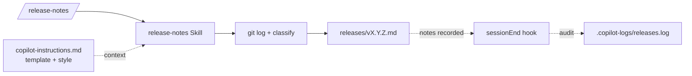

# ✨ Capstone — Release-notes pipeline

🟡 **Intermediate · ~45 min**

## Learning objectives

By the end of this exercise you can:

- **Compose** four customizations (instructions + prompt file + skill + hook)
  into a single pipeline.
- Run one slash command and produce a structured `releases/vX.Y.Z.md` from
  `git log`.
- Use a hook for **audit / observability**, not for the main workflow.

## Prerequisites

- You've done exercises **1 (custom instructions)**, **2 (prompt files)**, **3
  (skills)**, and **6 (hooks)**. (Reusing the same scratch repo is fine.)
- A repo with at least 5–10 commits on `main` so the release notes have
  something to summarize.
- ~45 minutes.

## Checkpoint commit

```bash
git commit --allow-empty -m "checkpoint: before capstone"
```

## Scenario

Your team cuts a release every other Friday. Right now, someone reads `git log`
manually, groups commits by hand, and writes the release notes. You want this
to be one command — `/release-notes v1.2.0` — that drops a fully-formed file in
`releases/`.

## Architecture



Four layers, one outcome:

| Layer | Role |
|---|---|
| **Custom instructions** | Define the release-notes template and the style ("imperative mood, no trailing period"). |
| **Prompt file** | The `/release-notes <tag>` entry point. Takes the version as `$ARGUMENT`. |
| **Skill** | The actual workflow: `git log`, classify by Conventional Commits, fill the template. |
| **Hook** | `sessionEnd` records that a release was generated (for audit), but **does not** create the file — that's the skill's job. |

## Steps

### 1. Custom instructions — the template

Append to `.github/copilot-instructions.md`:

```text
## Release notes

When asked to produce release notes, follow this template exactly:

  # vX.Y.Z — [date]

  ## Highlights
  [one or two sentences, user-facing]

  ## Features
  [bulleted `feat:` commits]

  ## Fixes
  [bulleted `fix:` commits]

  ## Other
  [docs / chore / refactor / perf]

Each bullet is the commit subject, in past tense, with the short SHA in
parentheses at the end.
```

### 2. Prompt file — the entry point

`.github/prompts/release-notes.prompt.md`:

```text
---
description: "Generate release notes for a version tag."
argument-hint: "[version, e.g. v1.2.0]"
---

# /release-notes

The user gave you `$ARGUMENT` as the version (e.g. `v1.2.0`). If empty, ask.

Delegate the actual work to the `release-notes` Skill. The skill is responsible
for git inspection, classification, and writing the file. Pass `$ARGUMENT`
through.

When the skill finishes, print the path to the generated file and ask the user
whether to commit it.
```

### 3. Skill — the workflow

```bash
mkdir -p .github/skills/release-notes
```

`.github/skills/release-notes/SKILL.md`:

```text
---
name: release-notes
description: |
  Generate release notes for a version tag from git history. Trigger via
  /release-notes, or natural language: "draft release notes for v1.2.0".
license: MIT
---

# release-notes

Produce `releases/[version].md` for the given version, grounded in `git log`.

## Output Contract

When this skill finishes:

1. `releases/[version].md` exists.
2. It has the four sections from `copilot-instructions.md` (Highlights /
   Features / Fixes / Other).
3. Every bullet ends with `(SHORT_SHA)`.

## Workflow

1. Find the **previous** version tag: `git tag --sort=-v:refname | grep -E
   '^v[0-9]' | head -2 | tail -1`. If none, use the repo root commit.
2. Run `git log --pretty='%h %s' [prev]..HEAD`.
3. Classify each commit by its Conventional Commits type prefix:
   - `feat:` → Features
   - `fix:` → Fixes
   - else → Other
   - no prefix → Other, with a `(?)` warning
4. Write the file at `releases/[version].md` using the template from
   `copilot-instructions.md`.
5. Print the path.
6. Optionally: suggest the commit message.

## Rules

- Never invent commits. Only summarize what's in `git log`.
- If two commits have the same subject (squash artifact), dedupe.
- If a `feat:` commit has a body referencing a breaking change, surface that as
  the first bullet in Highlights.
```

### 4. Hook — the audit trail

Extend the `sessionEnd` hook from [Exercise 6](06-hooks.md):

`.github/hooks/session-logger/log-session-end.sh` — add this block before the
final line of the script:

```bash
# Audit: did this session produce a release notes file?
if ls releases/*.md >/dev/null 2>&1; then
  LATEST="$(ls -t releases/*.md | head -1)"
  echo "[$TS] AUDIT session=$SESSION_ID generated_release=$LATEST" \
    >> "$LOG_DIR/sessions.log"
fi
```

The hook is **passive**: it observes and logs. It does not produce the release
notes; the skill does.

### 5. Run the pipeline

Make sure you have a couple of commits with proper prefixes:

```bash
echo a > a.txt && git add a.txt && git commit -m "feat: add feature A"
echo b > b.txt && git add b.txt && git commit -m "fix: handle edge case"
echo c > c.txt && git add c.txt && git commit -m "docs: clarify usage"
```

Now:

```bash
copilot
```

```text
/release-notes v0.1.0
```

The agent should:

1. Recognize `/release-notes` and invoke the prompt.
2. Hand the workflow to the `release-notes` skill.
3. Skill reads `git log`, classifies, writes `releases/v0.1.0.md`.
4. Agent prints the path.

Exit with `/exit`. The hook fires and writes an `AUDIT` line to
`.copilot-logs/sessions.log`.

## Definition of done { #definition-of-done }

All five must be true:

- [ ] `/release-notes v0.1.0` produces `releases/v0.1.0.md`.
- [ ] The file has all four sections (Highlights / Features / Fixes / Other) in
      that order.
- [ ] Every bullet ends with a `(SHORT_SHA)` reference.
- [ ] No commit is invented — every short SHA in the file appears in `git log
      --oneline`.
- [ ] `.copilot-logs/sessions.log` has an `AUDIT` line for this session
      pointing to the generated file.

## Reference solution { #reference-solution }

??? success "Show reference solution"
    There's no single solution file shipped for the capstone — by design, you
    compose pieces you've already built. Use these as templates while you work:

    - **Skill contract shape**: see [`examples/skills/pr-summary/SKILL.md`](https://github.com/ChibaYuki347/copilot-harness-workshop/blob/main/examples/skills/pr-summary/SKILL.md) — your `release-notes` skill should follow the same frontmatter + Workflow + Rules structure.
    - **Custom instructions style**: see [`examples/instructions/copilot-instructions.md`](https://github.com/ChibaYuki347/copilot-harness-workshop/blob/main/examples/instructions/copilot-instructions.md) — keep your "Release notes" section the same shape (template block, then per-bullet rules).
    - **Hook script**: see [`examples/hooks/session-logger/log-session-end.sh`](https://github.com/ChibaYuki347/copilot-harness-workshop/blob/main/examples/hooks/session-logger/log-session-end.sh) — extend it with the AUDIT block from [Step 4](#4-hook-the-audit-trail).

    If your `SKILL.md` produces output that's missing a section, the agent will
    still try its best. Defensive contracts (Output Contract section) catch this.

## Cleanup

```bash
rm -rf .github/prompts/release-notes.prompt.md \
       .github/skills/release-notes \
       releases/
# Remove the "## Release notes" section from .github/copilot-instructions.md
# Remove the AUDIT block from log-session-end.sh
```

## Troubleshooting

- **`/release-notes` runs but doesn't call the skill.** Tighten the prompt
  body: "**You must** delegate to the `release-notes` skill. Do not generate
  the notes yourself." Skills aren't called automatically just because they're
  available.
- **Sections are out of order or one is missing.** The skill's Output Contract
  must say "exactly these sections, in this order". The model will skip empty
  ones if you don't say "include the heading even if the section is empty —
  write *None this release*".
- **AUDIT line never appears.** Confirm `releases/` exists and contains at
  least one `.md` at session end — the hook only writes the line if it does.

## What not to do

- **Don't put the file-writing logic in the hook.** Hooks run synchronously on
  the session lifecycle; if `sessionEnd` does heavy work it'll block your
  `/exit`. Keep hooks observational.
- **Don't bake the version number into the prompt or skill body.** It comes
  from `$ARGUMENT`. Hardcoding it breaks the next release.
- **Don't add the `releases/` folder to `.gitignore`.** The whole point is to
  commit these files — they are the release notes.

## Stretch goals

1. **Wire in a custom agent** (from [Exercise 5](05-agents.md)): after the skill
   writes the file, delegate to a `release-reviewer` agent that re-reads the
   file and confirms every short SHA exists in `git log`. Fail loud if not.
2. **Add an MCP server** (from [Exercise 4](04-mcp.md)): expose `releases/` via
   the filesystem MCP and let the agent list previous releases for context
   ("how did we phrase v0.0.9's highlights?").
3. **Hook gate.** Add a `preToolUse` hook on the `edit` tool that **blocks**
   writes to `releases/` unless the path matches the version from the current
   prompt. Forces the skill to use the right filename.

---

You did it. You composed four customizations into one pipeline. That's the
pattern: every real Copilot workflow at scale is a composition like this. From
here, the only thing left is making your own.
