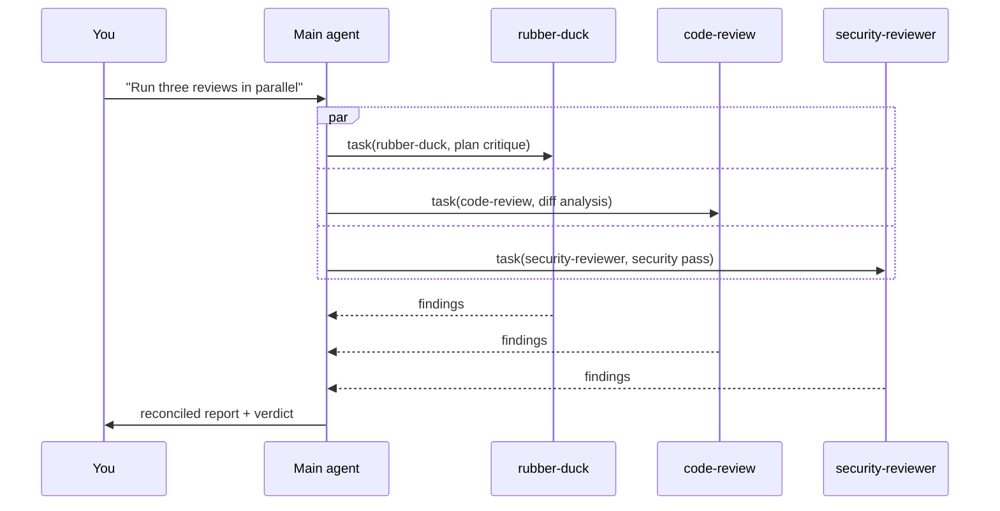

# レシピ: マルチエージェントワークフロー

**ラバーダック、code-review、security-reviewer を並列実行し、その
結果をマージ前に突き合わせます。**

## 課題

しっかりしたマージ前チェックには、異なる 3 つの視点が必要です:

1. *設計や方針は妥当か?* → ラバーダック。
2. *実装は正しいか?* → コードレビュー。
3. *安全に出荷できるか?* → セキュリティレビュー。

これを 1 つの会話で順番に行うと遅く、コンテキストも汚れます。ハーネスでは
**フリートモード** と **カスタムエージェント** によって並列実行できます。

## 使うレイヤー

- **組み込みサブエージェント**（`rubber-duck`, `code-review`）。
- **カスタムエージェント**（`security-reviewer` — [examples/agents/security-reviewer.agent.md](https://github.com/ChibaYuki347/copilot-harness-workshop/blob/main/examples/agents/security-reviewer.agent.md) を参照）。
- **フリートモード** で並列化します。

## ファイル構成

カスタムエージェントをリポジトリに追加します:

```
.github/agents/security-reviewer.agent.md
```

内容:

```markdown
---
name: security-reviewer
description: |
  差分を対象に、認証情報の漏えい、SSRF、インジェクション、不安全な
  暗号、認証回避などのセキュリティ問題をレビューします。読み取り専用で、ファイルは編集しません。
  セキュリティレビュー、セキュリティチェック、マージ前の安全性確認を求められたときに起動します。
tools: ["read", "search"]
model: claude-sonnet-4.5
---

# セキュリティレビュアー

セキュリティレビュー担当です。出力は会話ではなく、構造化されたレポートにします。

（ワークフロー本体は `examples/agents/security-reviewer.agent.md` を参照）
```

## 動作の流れ

```text
/fleet
```

その後、エージェントが機能を実装し、出荷できる状態になったら次のように伝えます:

```text
Run three reviews in parallel:
1. The rubber-duck agent: critique the design as implemented.
2. The code-review agent: surface bugs and risky changes in the diff.
3. The security-reviewer agent: security pass on the diff.

When all three are done, reconcile their findings into a single ranked list and tell
me whether to merge.
```

### 内部で起きること



`task` ツールは、それぞれのサブエージェントを **独立したコンテキストウィンドウ** に起動します。そのため、メイン
セッションは整理されたままです。サブエージェントは完了時に結果を返し、メインエージェントが待ってから統合します。

## 突き合わせのルーブリック

メインエージェントに、検出結果の優先順位付けルールを伝えます:

```text
Reconciliation rules:
- Deduplicate findings that point to the same file:line.
- Severity precedence: any Critical → block merge; else any High → block merge;
  else Medium and below → allow merge with notes.
- For each kept finding, attribute which agent surfaced it.
- Output a single Markdown table sorted by severity desc.
```

これはよい「カスタムインストラクション」の題材です。毎回繰り返さなくて済むよう、`.github/copilot-instructions.md`
に書いておくと便利です。

## バリエーション

- **小さな PR ではラバーダックを省く。** メインエージェントに「変更が 50 行超、3 ファイル超、
  または `auth/` に触れているか」を自己評価させます。該当しない場合は code-review だけを実行します。
- **doc-checker を追加。** ユーザー向けの変更があるときに `CHANGELOG.md` と公開ドキュメントが
  更新されているかを確認するカスタムエージェントを追加します。
- **CI から実行。** headless モードの `copilot -p '...'` と組み合わせ、PR が開かれるたびに
  このレビュー群を実行します。

## 確認方法

```text
/tasks       # show background sub-agents
/sidekicks   # show running sidekick agents
```

どちらの画面からも、各サブエージェントが何をしているかを確認できます。

## 落とし穴

!!! warning "不要なものまでフリートにしない"
    3 つのエージェントを起動すると、トークンコストも 3 倍になります。5 行だけの CSS 修正には過剰です。
    フリートレビューは、それに見合う変更（複数ファイル、セキュリティに関わるパス、公開 API の変更）に絞ります。

## 試してみる

`examples/agents/security-reviewer.agent.md` をリポジトリに追加し、上記のとおりに呼び出します。
