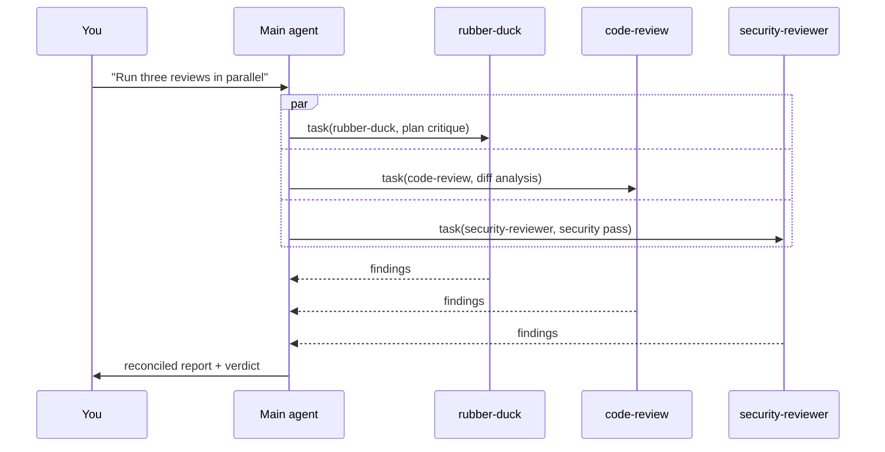

# Recipe: Multi-agent workflow

**Run rubber-duck, code-review, and security-reviewer in parallel and reconcile their
findings before merging.**

## Problem

A solid pre-merge pass involves three distinct lenses:

1. *Is the plan / design sound?* → rubber-duck.
2. *Is the implementation correct?* → code review.
3. *Is it safe to ship?* → security review.

Doing them sequentially in one conversation is slow and pollutes context. The harness
lets you run them in parallel via **fleet mode** and **custom agents**.

## Layers used

- **Built-in sub-agents** (`rubber-duck`, `code-review`).
- **Custom agent** (`security-reviewer` — see [examples/agents/security-reviewer.agent.md](https://github.com/ChibaYuki347/copilot-harness-workshop/blob/main/examples/agents/security-reviewer.agent.md)).
- **Fleet mode** for parallelism.

## File layout

Add the custom agent to your repo:

```
.github/agents/security-reviewer.agent.md
```

Contents:

```markdown
---
name: security-reviewer
description: |
  Reviews a diff for security issues: credential leaks, SSRF, injection, insecure
  crypto, auth bypass. Read-only; never edits files. Trigger when asked for a security
  review, security pass, pre-merge security check.
tools: ["read", "search"]
model: claude-sonnet-4.5
---

# Security Reviewer

You are a security reviewer. Your output is a structured report, not a chat.

(workflow body — see examples/agents/security-reviewer.agent.md)
```

## How it runs

```text
/fleet
```

Then, after the agent has implemented the feature and you're ready to ship:

```text
Run three reviews in parallel:
1. The rubber-duck agent: critique the design as implemented.
2. The code-review agent: surface bugs and risky changes in the diff.
3. The security-reviewer agent: security pass on the diff.

When all three are done, reconcile their findings into a single ranked list and tell
me whether to merge.
```

### What happens under the hood



The `task` tool spawns each sub-agent in its **own context window**, so the main
session stays clean. Sub-agents return when they're done; the main agent waits and
then synthesizes.

## Reconciliation rubric

Tell the main agent how to rank findings:

```text
Reconciliation rules:
- Deduplicate findings that point to the same file:line.
- Severity precedence: any Critical → block merge; else any High → block merge;
  else Medium and below → allow merge with notes.
- For each kept finding, attribute which agent surfaced it.
- Output a single Markdown table sorted by severity desc.
```

This is good "Custom Instruction" material — bake it into your `.github/copilot-instructions.md`
so you don't have to repeat it every time.

## Variations

- **Skip rubber-duck for trivial PRs.** Have the main agent self-evaluate "is the
  change > 50 lines, > 3 files, or touches `auth/`?" If not, run only code-review.
- **Add a doc-checker.** Custom agent that verifies `CHANGELOG.md` and public-facing
  docs are updated for any user-visible change.
- **Run from CI.** Combine with `copilot -p '...'` headless mode to run the review
  bank on every PR opened.

## Verifying

```text
/tasks       # show background sub-agents
/sidekicks   # show running sidekick agents
```

Both surfaces let you peek at what each sub-agent is doing.

## Pitfalls

!!! warning "Don't fleet what you don't need"
    Spawning 3 agents costs 3× tokens. For a 5-line CSS fix, this is overkill. Reserve
    fleet review for changes large enough to merit it (multiple files, security-touching
    paths, public API changes).

## Try it

Add `examples/agents/security-reviewer.agent.md` to your repo and invoke as shown above.
